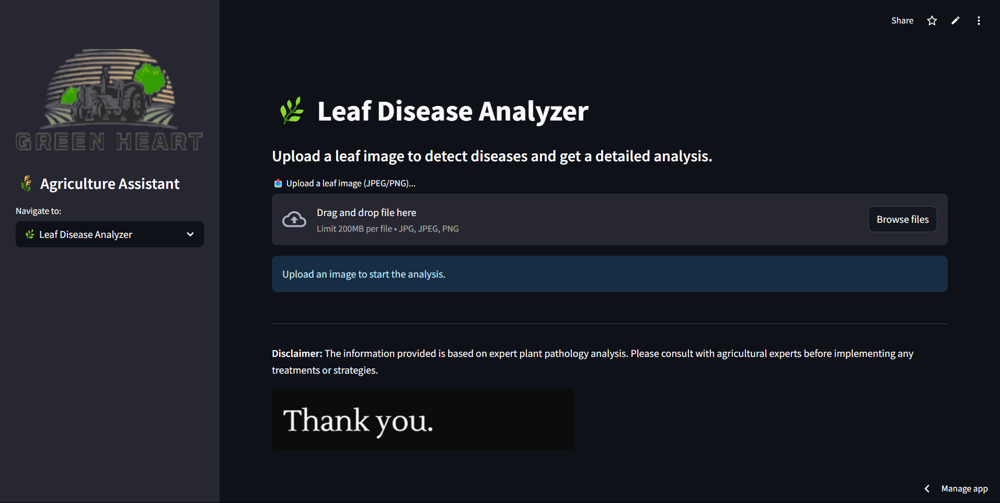
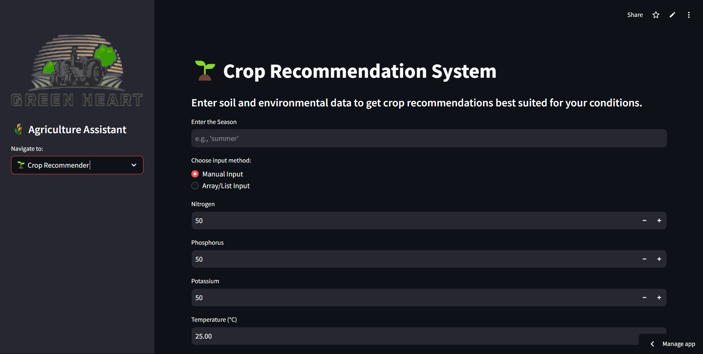
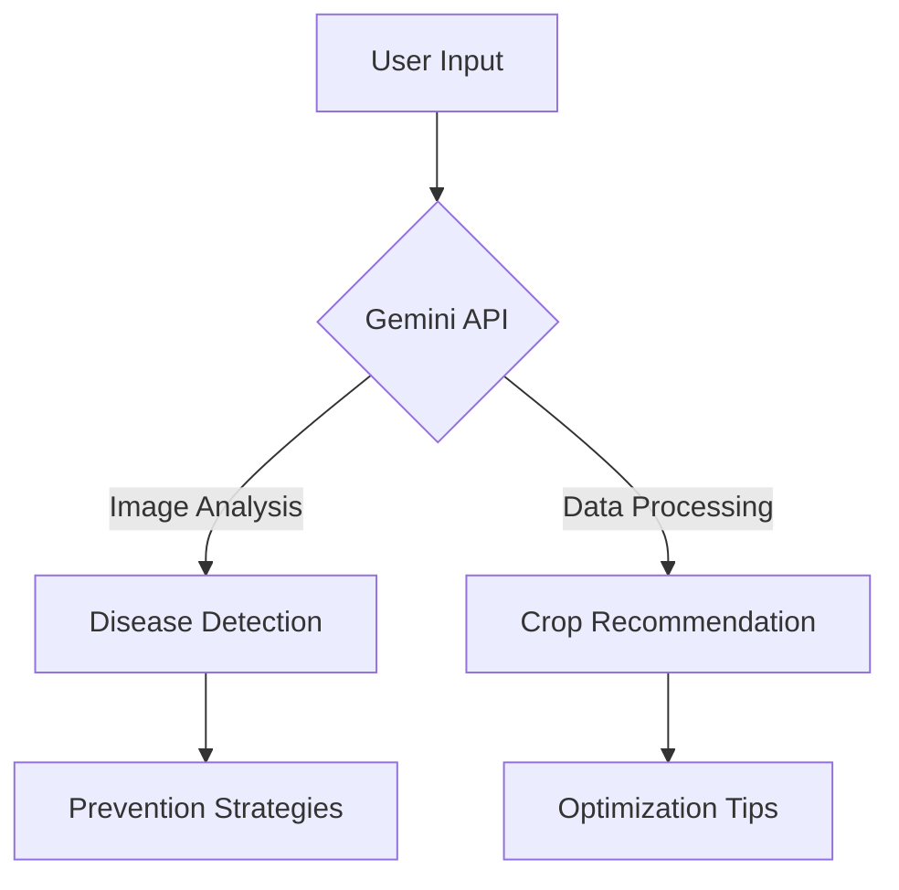

# GreenHeart AI 🌱

[](https://greenheart.streamlit.app/)
[](https://python.org)
[](LICENSE)

**AI-powered agricultural assistant leveraging Gemini API for intelligent crop management**

 <!-- Update path -->
 <!-- Update path -->

## ✨ Features

### 1. Plant Disease Analyzer 🔍
- Image-based plant health assessment
- Real-time analysis using Gemini Vision API
- Detailed disease identification and prevention advice
- Support for multiple crop varieties

### 2. Crop Recommendation System 🌾
- Climate-aware crop suggestions
- Soil parameter analysis (N-P-K, pH, moisture)
- Sustainable farming recommendations
- Market insights and yield optimization

## 🚀 Quick Start

### Prerequisites
- Python 3.10+
- Google API Key (for Gemini)

### Installation
```bash
# Clone repository
git clone https://github.com/Vasu-bansal-24/GreenHeart.git
cd GreenHeart

# Install dependencies
pip install -r requirements.txt
```

### Configuration
1. Create `.env` file in root directory:
```env
GOOGLE_API_KEY=your_api_key_here
```

### Run Application
```bash
streamlit run app.py
```

## 🛠️ Tech Stack

**Core Technologies**  


**Supporting Libraries**  


## 🌐 Live Demo

Access the production deployment:  
[https://greenheart.streamlit.app/](https://greenheart.streamlit.app/)

## � How It Works



## 🤝 Contributing

1. Fork the repository
2. Create feature branch (`git checkout -b feature/your-feature`)
3. Commit changes (`git commit -m 'Add amazing feature'`)
4. Push to branch (`git push origin feature/your-feature`)
5. Open a Pull Request

## 📧 Contact

**Vasu Bansal**  
[](mailto:vasu.bansal1204@gmail.com)  
[](https://www.linkedin.com/in/vasu-bansal-45770228b/)